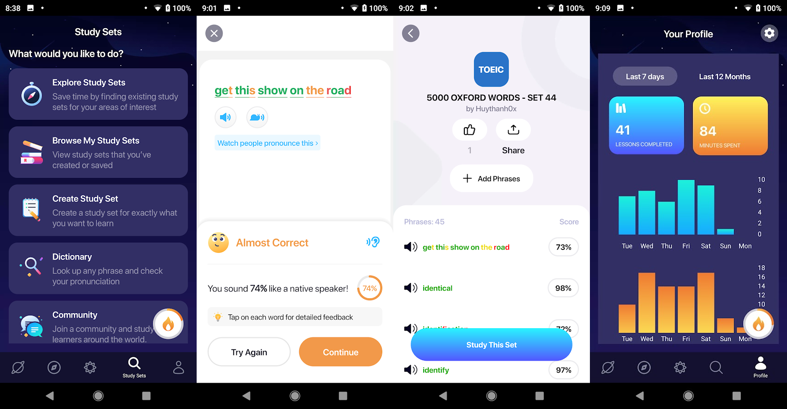
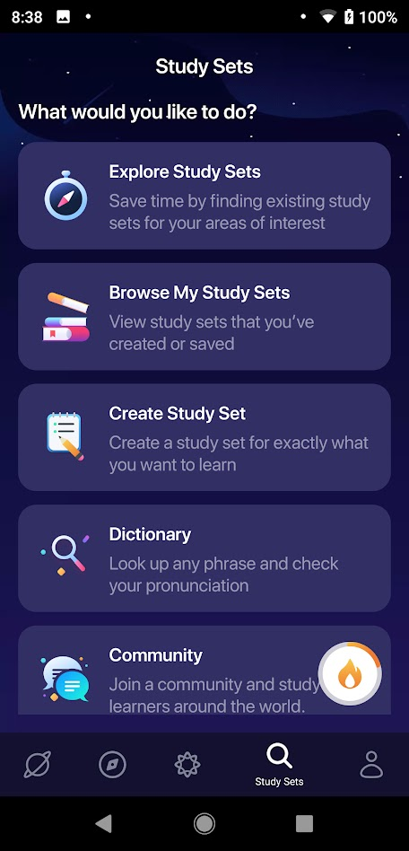

# AUTO ADD TRANSCRIPTS TO ELSA SPEAK FOR PRACTISE
## THE PROBLEM AND SOLUTION

||
|:----------------:|
|ELSAE SPEAK is one of the best AI assistant for imporving your pronunciation.|

If you subcribe to **PRO membership**. It analyse your weakness and your strength to make a personal plan for yourself. And there are variaty off game-type to practise and there are over 1600 lessons. It cost you 1-year membership for $44.99. Not really high but low.
What if you use **FREE plan**. You still can learn limited lesson, normally it's 5 lesson a day. That is not enough for a day. But there are a speacial feature name study set. You can create your own set, you also can share your set or browse other set. You can join communitis for specific topic or list too.
What is advantage of this feature-study set:
- You can custom your own plan, you can choose anything you like to learn, from random topic, academic question, random song or even some random speech from Youtube.
- It cost you nothing, that mean you don't need to subscribe to PRO membership to using this, And lesson from study list is not count to daily limitted lesson.

But the problem come in from here, because it take about 3-4 step to add a single random phrase/word to your study list. And if you wanna at 100 phrases to study per day. It can be a nightmare. Time consume lead to poor resources in study lis/community at ELSA.

And I am here today to give you an solution, super fast solution. It is quite easy to use, not require must knowlege at Information Technology field. There are two options in my application.First option You can copy a random transcript any where and run the code, this app will automatically split your transcript and add it to your ELSA's study set. Second option is adding a long list of word, in my case is 5000 Oxford words. It will auto matically split your list to multiple set and sequently add it to ELSA's study set.

## RUN THE CODE ON YOUR OWN

### Prepare step
- [Python enviroment](https://www.python.org/downloads/) to run some detection
- [Android Debug Bridge (adb)](https://developer.android.com/studio/command-line/adb) to control your phone from shell/terminal 
- [Follow this instructor](https://developer.android.com/studio/command-line/adb#Enabling) to enable USB-debugging in your phone
- Download or clone this project, and open it from terminal or VsCode
- Download requirements `pip3 install -r requirements.txt`
- Connect your phone to PC via this command `adb devives` 
**If the output are empty** you should check your adb installation step and check whether your debugging was turned on or not

###  Execute step

**Ato add a Transcript/conservation/song etc:**

**Step1:** *Open your phone to this screen*

**Step2:** Copy and paste your script to `transcript/transcript.txt`

**Step3:** Start program via this command `python3 auto_add_elsa_from_transcript.py `

**Auto add a list of word (a large a mount of lines):**

**Step1:** *Open your phone to this screen*

**Step2:** Copy and paste your script to `set_word/origin_word_list.txt`

**Step3:** Start program via this command `auto_add_elsa_from_list.py`|

