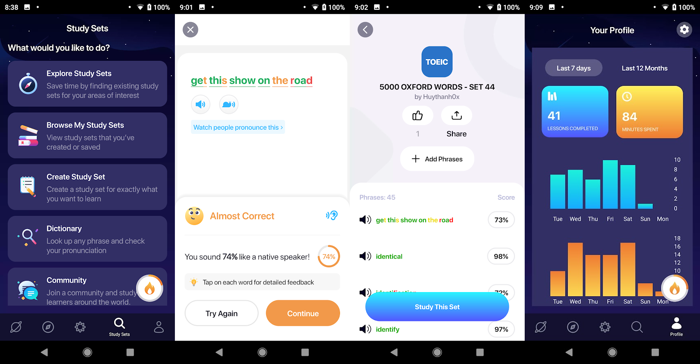
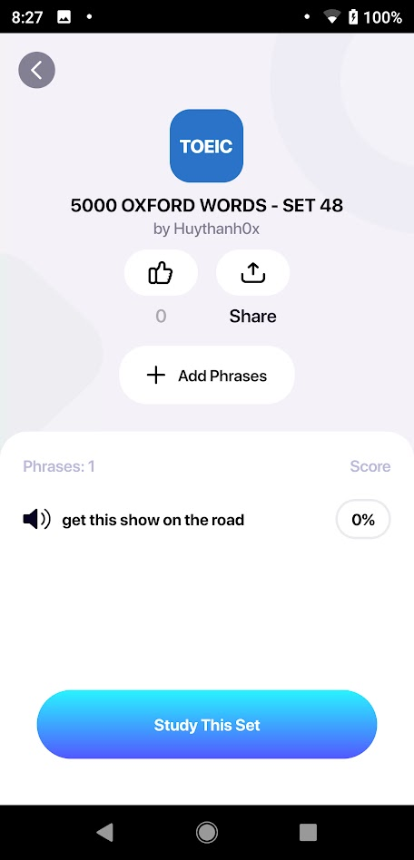
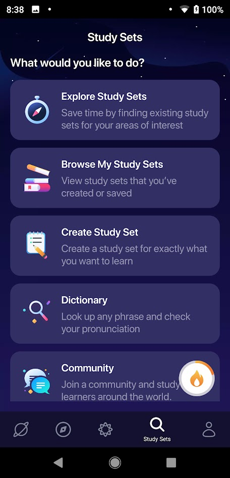

# AUTO ADD TRANSCRIPTS TO ELSA SPEAK
## THE PROBLEM AND SOLUTION

||
|:----------------:|
|ELSAE SPEAK is one of the best AI assistants for improving your pronunciation.|

If you subscribe to PRO membership. It analyses your weakness and your strength to make a personal plan for yourself. And there is a variety of game-type to practice and there are over 1600 lessons. It cost you 1-year membership for $44.99. Not high but low.
What if you use a FREE plan. You still can learn a limited number of the lesson, normally there are 5 lessons a day. That is not enough for a day. But there is a special feature named the study set. You can create your own set, you also can share your set or browse other sets. You can join communities for specific topics or lists too.

What is the advantage of this feature-study set:

- You can customize your plan, you can choose anything you like to learn, from a random topic, academic question, random song, or even some random speech from Youtube.
- It cost you nothing, which means you don't need to subscribe to PRO membership to use this feature, And the lesson from the study list is not counted to the daily limited lesson.

But the problem comes in from here because it takes about 3-4 steps to add a single random phrase/word to your study list. And if you wanna at 100 phrases to study per day. It can be a nightmare. Time consumption leads to poor resources in the study list/community at ELSA.

And I am here today to give you a solution, super fast solution. It is quite easy to use, not require must knowledge in Information Technology field. There are two options in my application. The first option You can copy a random transcript anywhere and run the code. This app will automatically split your transcript and add it to your ELSA's study set. The second option is adding a long list of words. In my case is 5000 Oxford words. It will automatically split your list into multiple sets and sequentially add it to ELSA's study set.

## RUN THE CODE ON YOUR OWN

### Prepare step
- [Python environment](https://www.python.org/downloads/) to run some detection
- [Android Debug Bridge (adb)](https://developer.android.com/studio/command-line/adb) to control your phone from shell/terminal 
- [Follow this instructor](https://developer.android.com/studio/command-line/adb#Enabling) to enable USB-debugging in your phone
- Download or clone this project, and open it from terminal or VsCode
- Download requirements `pip3 install -r requirements.txt`
- Connect your phone to PC via this command `adb devives` 
**If the output is empty** you should check your adb installation step and check whether your debugging was turned on or not

###  Execute step

**To add a Transcript/conservation/song etc:**

**Step1:** *Open your phone to this screen*

**Step2:** Copy and paste your script to `transcript/transcript.txt`

**Step3:** Start program via this command `python3 auto_add_elsa_from_transcript.py `

**To add a list of words (a large amount of lines):**

**Step1:** *Open your phone to this screen*

**Step2:** Copy and paste your script to `set_word/origin_word_list.txt`

**Step3:** Start program via this command `auto_add_elsa_from_list.py`|

## JOIN MY COMMUNITY

Currently, I have created a community in ELSA. In this one, I had created a list of 5000 Oxford words and it was split into 100 sets, which means there are about 50 words per set.
Soon, I will continuously update new sets relate to speech and IELTS topics and some small sets that are related to famous songs. For instance: girls like you, that girl, at my worst, etc